# Audio RAG proposal

## Status and authority

This document is the stakeholder-approved target design for audio ingestion and
text-only retrieval. It is not implemented or deployed behavior. Design approval does
not authorize code, infrastructure, deployment, or commit changes.

The committed `HEAD` document pipeline is the compatibility baseline. Existing
uncommitted audio-specific code and documentation are excluded as design evidence and
may be replaced during an approved implementation. They must not constrain the target
architecture.

Evidence status: **Partial**. Repository contracts and Microsoft product behavior are
sufficient for a conditional architecture and implementation plan. Workload acceptance,
live identity/private-network behavior, regional availability, quality, throughput, and
contract pricing remain required before writer implementation or deployment approval.

## Request

Extend the SharePoint-based enterprise RAG pipeline to ingest supported audio through a
configurable Azure provider, preserve source metadata and ACLs, publish timestamped text
using the existing schema-version-1 manifest and chunk stores, reuse the existing
embedding and retrieval pipeline, and cite the original SharePoint audio item.

Design requirements:

- Complete and review requirements, research, plan, architecture, and decisions before
  implementation.
- Preserve existing document ingestion and retrieval behavior.
- Keep SharePoint as the source and authorization authority.
- Return transcript text and timestamp citation metadata during retrieval, not audio.
- Address language and format support, regional availability, private networking,
  scalability, monitoring, failure handling, and cost.
- Keep the transcription provider configurable without implementing speculative
  fallback or multiple providers in the first release.

## Assumptions and open questions

Assumptions requiring confirmation before release:

- The initial corpus can be restricted to WAV, MP3, and FLAC.
- The initial locales can be restricted to `en-US`, `en-GB`, and `en-IN`.
- Retrieval consumers need transcript evidence and timestamps only.
- Eventual transcript availability is acceptable to callers; each Fast request still
  completes or times out inside its bounded document activity.
- The initial product ceiling is 300 MB and two hours per file; this is a proposed
  constraint, not an observed corpus fact.

Open questions and evidence gates:

1. Does the business accept the 300 MB/two-hour ceiling, and what are the observed file
  size, duration, codec, locale, concurrency, and daily audio-hour distributions?
2. Which target region is approved, and does it support every selected Speech feature?
3. Can Fast Transcription authenticate with the Function managed identity through the
  intended private endpoint at the required concurrency and timeout?
4. What transcription quality threshold and representative evaluation set are approved?
5. What monthly Speech, Function compute, Cosmos, and embedding budget is approved?
6. Is inheriting the existing document-record retention and lifecycle policy for failed,
  retired, and superseded audio records approved?

No answer is inferred for these questions.

## Stable repository constraints

The committed pipeline establishes these contracts:

- [Architecture](ARCHITECTURE.md) defines SharePoint/Graph discovery and ACL authority,
  Durable Functions orchestration, schema-version-1 Cosmos records, lifecycle states,
  embedding, and ACL-filtered retrieval.
- `app/ingestion/services.py::process_document` downloads one source version, verifies
  its ACL, creates chunks and embeddings, writes nonready records, rechecks source and
  ACL state, and then admits the document as ready.
- `app/ingestion/repository.py::write_chunks` and
  `verify_and_mark_document_ready` own publication and readiness verification.
- `app/ingestion/lifecycle_repository.py` owns ACL refresh, retirement, supersession,
  deletion, and interrupted-transition recovery.
- `app/function_app.py::full_sync_orchestrator` processes bounded waves, while
  `delta_sync_orchestrator` advances the SharePoint change path.
- `app/retrieval/cosmos.py::SecureCosmosRetriever` applies `isRetrievable` and caller
  ACL filters before returning text chunks.

Audio extends these contracts; it does not create a second RAG store or retrieval
pipeline.

## Provider options

| Option | Strength | Cost and complexity | Decision |
| --- | --- | --- | --- |
| Speech Fast Transcription | Synchronous result, direct upload, timestamps, documented Entra path, and current limits above the proposed envelope | Request duration and concurrency require measurement | **Recommended v1 under the approved envelope** |
| Speech Batch Transcription | Asynchronous jobs, storage-based input/results, timestamps, archive-scale processing | Durable job state, BYOS/staging, polling, cleanup, and unresolved exact REST identity proof | Escalation option when workload evidence requires it |
| LLM Speech enhanced | Prompting, translation, and richer recognition in Fast Transcription | Narrower regional availability and extra quality/cost validation | Defer until benchmarked need |
| Content Understanding audio | Unified transcript and structured multimodal analysis | Foundry resource/model defaults and broader output contract than required | Defer until structured audio analysis is required |

### Recommendation

Use Azure Speech Fast Transcription in default mode behind a narrow provider port for
v1, provided the business accepts the 300 MB/two-hour ceiling and a live test proves the
required latency and concurrency. Current Microsoft guidance places that envelope within
Fast limits. Scale v1 with bounded concurrent activities and backpressure, not an
unproven asynchronous subsystem.

Challenge to a common assumption: Microsoft documentation calls the prerequisite a
"Microsoft Foundry resource for Speech." That resource naming does not make a Foundry
project, agent, playground, or Foundry SDK a runtime dependency. The Function calls the
Speech data-plane API. A Foundry project is optional for experimentation.

Escalate to Batch only when measured duration, volume, concurrency, or latency violates
the accepted Fast envelope. That decision requires a separate Batch identity, BYOS,
polling, reconciliation, retention, and cost review. There is no automatic Fast-to-Batch
fallback.

## Target architecture

```mermaid
flowchart LR
    SP[SharePoint and Graph] --> DISC[Existing discovery and ACL]
    DISC --> PROC[Existing process-document activity]
    PROC --> SPEECH[Azure Speech Fast]
    SPEECH --> NORM[Transcript normalization in activity]
    NORM --> EXIST[Existing chunk, embed, publish lifecycle]
    EXIST --> DATA[Schema-v1 manifests and chunks]
    DATA --> RET[Existing text retrieval]
    RET --> ANS[Text answer and SharePoint timestamp citation]
```



### Boundaries and dependency direction

| Boundary | Owns | Depends on |
| --- | --- | --- |
| SharePoint connector | Source reads, metadata snapshots, ACL verification | Microsoft Graph and SharePoint |
| Speech adapter | Fast request/response semantics and provider error translation | Speech |
| Transcript normalizer | Provider-neutral validated timed segments | Speech adapter output |
| Existing document activity | Source/ACL checks, bounded retry, chunking, embedding, publication | Connector and normalized segments |
| Existing lifecycle owner | ACL refresh, supersede, delete, retire, repair | Manifest/chunk repositories |
| Existing retrieval | ACL filtering, ranking, answer grounding, citations | Ready schema-v1 records |

Provider response shapes and credentials stop at the Speech adapter. Retrieval never
depends on Speech.

## Contracts

### Provider port

The provider abstraction exists to isolate an external contract and permit a separately
approved future provider. It is not a general plugin framework. Its v1 capabilities are:

- transcribe one validated immutable source version synchronously;
- return the selected provider/API/profile identity;
- translate provider failures into stable retryable or terminal errors.

The normalized result contains only transcript segments with text, start and end
milliseconds, locale, and optional speaker/channel fields when explicitly supported.

### Processing and retry identity

Audio follows the existing deterministic document identity, source-run partition,
attempt count, lifecycle generation, and ETag-guarded state transitions. Do not add an
audio operation container, lease, permit, or source-wide lock for Fast v1.

The existing document activity owns one synchronous attempt: validate source and ACL,
download bounded bytes, call Fast, normalize, chunk, embed, write the pending generation,
recheck source and ACL, and admit readiness. A timeout can cause a repeated billable Fast
call, so the existing activity retry count remains bounded and is included in cost
telemetry. Deterministic document/chunk keys and lifecycle fencing prevent duplicate or
stale publication; they do not prevent duplicate provider cost.

### Schema version 1

Reuse the existing source-manifest and search-chunk record types and partitioning.
Extend their schema-version-1 shape additively:

- manifest audio metadata: duration in milliseconds, optional channel count (omitted when
  the provider does not report it), locale, provider/profile/API
  provenance, source content hash, and source verification time;
- chunk modality: `audio_transcript`;
- temporal locator: `locatorKind: time`, `startMs`, and `endMs`;
- evidence version derived from the immutable source/transcription identity.

The MIME type and locator kind discriminate audio records. Readers reject contradictory
combinations, including document MIME with a time locator or audio MIME without valid
timestamps. Reusing schema version 1 requires reader-first deployment; it does not make
old readers audio-aware.

Compatibility rules:

| Field | Document record | Audio record | Compatibility rule |
| --- | --- | --- | --- |
| `schemaVersion` | Required, `1` | Required, `1` | Unchanged discriminator |
| `mimeType` | Existing document allowlist | Approved normalized audio MIME | Extend allowlist; reject mismatch with locator/modality |
| `pageCount`, `pageStart`, `pageEnd` | Existing required/conditional semantics | Omitted | Make temporal records explicitly exempt; document serialization unchanged |
| `locatorKind` | Existing page/section/slide/worksheet | Required `time` | Reader support deploys before audio publication |
| `locatorOrdinalStart/End` | Existing positive ordinal range | Positive transcript-segment range | Existing ordering contract retained |
| `modalities` | Existing tuple | Includes `audio_transcript` | Reject audio modality on document MIME |
| `provenance` | Existing extraction values | Includes `transcribed` | Reject transcription provenance on document MIME |
| `visualCoverage` | Existing visual state | Required `not_required` | Audio never claims visual coverage |
| `languageCode` | Existing normalized language | Required `en` for initial locales | Locale remains separately preserved in audio metadata |
| `startMs`, `endMs` | Prohibited | Required bounded integers | `0 <= startMs < endMs <= durationMs` |
| `audio` | Prohibited | Required on manifest; prohibited on chunk | Exact manifest fields: `durationMs` positive integer; `channelCount` optional (omitted, since Azure Speech fast transcription does not return the source channel count in default mode); `operatorReplayCount` nonnegative integer; `locale`, `provider`, `profile`, `apiVersion`, `sourceContentHash`, and `evidenceVersion` nonempty strings |
| `sourceVerifiedAt` | Omitted | Required UTC timestamp | Records the final successful source-version check |
| `contentHash` | Hash of extracted document text | Hash of normalized transcript text | Existing semantic is preserved |
| `evidenceVersion` | Omitted | Required nonempty string on each chunk | Must equal the owning manifest `audio.evidenceVersion` |
| `sourceUrl` | Original SharePoint URL | Original SharePoint URL | Never provider or staging URL |

`sourceContentHash` is lowercase SHA-256 of the downloaded audio bytes.
`evidenceVersion` is lowercase SHA-256 of canonical UTF-8 JSON containing, in order,
`sourceId`, `driveId`, `itemId`, `eTag`, `sourceContentHash`, `locale`, `provider`,
`profile`, and `apiVersion`, serialized with compact separators and no extra fields. The
same value is copied to the manifest, every chunk, and each citation.

The citation response keeps existing required `ref`, `source_name`, `location`, and
`url` fields. Audio adds optional `start_ms`, `end_ms`, and `evidence_version`; document
responses omit them. References retain the canonical `[S#]` labels enforced by existing
retrieval. `location` remains display text, for example `02:05-02:26`.

### Publication invariant

Audio uses the existing fail-closed publication pattern:

1. Download the exact SharePoint version and hash its bytes.
2. Verify the current source ACL.
3. Call Fast and normalize the response in the same activity.
4. Chunk, enrich when configured, and embed transcript text.
5. Write the pending manifest and chunks using the existing generation flags.
6. Immediately re-read source identity and ACL.
7. Reject publication if eTag, content hash, item identity, or ACL changed.
8. Admit one complete lifecycle generation as ready and retrievable.
9. Retire or delete the superseded generation through the existing lifecycle owner.

Every published audio chunk must match the ready manifest's document key, source eTag,
source content hash, lifecycle generation, ACL, and evidence version. Admission is
logically atomic, not a cross-container Cosmos transaction. Existing chunks may carry
`isRetrievable=true` before the manifest becomes ready, but they remain logically
ineligible because retrieval requires the ready manifest and matching generation. The
ready manifest commit marker is written only after all expected records are verified,
so every intermediate write order remains fail closed.

### Full-sync and delta semantics

Full sync includes audio in bounded document waves and finalizes after each activity
succeeds, fails, or is fenced by the existing wave timeout.

Refactor delta coordination before admitting audio: one activity reads one Graph delta
page; the orchestrator sends changed files through the same bounded
`process_document_activity` path and timeout used by full sync; a final activity saves
that page's `nextLink` or terminal `deltaLink` only after every item succeeds or is safely
skipped. A failed/timed-out item leaves the prior cursor unchanged. Replay may repeat
already-completed items, which the existing deterministic document identity and ready
source-version check must skip without another Speech call. Bound pages per orchestration
with the existing delta-page limit and use `continue_as_new` between successful pages so
history per execution remains bounded.

This changes delta implementation structure but preserves its external invariant: the
cursor advances only after all items represented by the saved cursor are durably handled.
Each source eTag gets at most the configured Durable activity attempt count. If transient
attempts are exhausted, a separate non-Speech finalization activity conditionally writes
a failed manifest for that source eTag and sanitized failure class. That durable failed
state is a handled terminal item, allowing the page cursor to advance without losing a
later source update. Retrying the same eTag then requires an explicit operator replay;
timer ticks do not issue another billable Speech call. Terminal provider/media failures
use the same failed state without activity retry. The run reports completed-with-errors
rather than silently treating either case as success.

Extend the existing `POST /ingestion/retry-failed` operation and retry orchestrator to
select failed current source versions from full-sync and delta runs, conditionally reset
each failed manifest to discovered, and process it through the same bounded document
activity. A successful conditional reset is the persisted replay transition; stale or
superseded eTags are skipped. `audio.operatorReplayCount` is scoped to the source eTag,
incremented atomically with that reset, and never cleared by activity attempts or another
operator request. Reject the request when it reaches
`AUDIO_MAX_OPERATOR_REPLAYS_PER_ETAG`, default `1`.

Replay requires the `Ingestion.Admin` EasyAuth app role through the existing
`require_easy_auth_role()` helper. A break-glass replay also requires
`AUDIO_REPLAY_OVERRIDE_ENABLED=true`, `override=true`, and a bounded reason code; the
flag defaults to `false` and its enablement requires recorded risk/cost approval. Every
request writes a sanitized service-audit event containing actor object ID, source ID,
document ID, eTag, prior/new count, override flag, reason code, transition outcome, and
correlation ID. Do not audit transcript text, source URL, or provider payload.

Do not pass audio bytes, transcript text, provider payloads, or source URLs through
orchestration inputs, outputs, or custom status. The activity receives the existing
document reference and returns the existing sanitized activity outcome. If representative
Fast latency cannot fit the approved activity and wave timeout, stop and reopen ADR-1 for
Batch rather than changing run semantics implicitly.

## Security and networking

Use a dedicated Speech resource. Fast v1 uploads validated bytes directly from the
Function and does not require provider staging or BYOS storage. Do not reuse or widen the
Function runtime storage trust boundary.

- Use a Speech custom domain and private endpoint with approved private DNS.
- Disable public network access after the private path is verified.
- Grant the Function managed identity `Cognitive Services Speech User` on the Speech
  resource; do not use the broader `Cognitive Services User` role.
- Require the `Ingestion.Admin` app role for audio retry and break-glass operations.
- Keep source bytes in activity memory only for the bounded request.
- Persist transcript text only in the pending manifest/chunk publication path protected
  by ready-manifest validation; do not add a raw transcript checkpoint for Fast v1.
- Never log raw audio, transcript text, SAS URLs, credentials, or sensitive metadata.
- Durable orchestration history contains the existing bounded document reference and
  sanitized outcome only; it must never contain audio bytes, transcript segments,
  provider payloads, SAS URLs, or credentials.

Before writer implementation, a bounded spike must prove Fast Transcription through the
intended managed identity, private endpoint, DNS, request-size, timeout, and concurrency
path. If the workload forces Batch, separately decide BYOS at Speech resource creation,
container/path ownership, `sasValidityInSeconds=0` result retrieval, Speech system
identity RBAC, TTL/job deletion, private DNS, and exact Batch API authentication. A Key
Vault-held Speech key, local-auth posture, rotation, and failure behavior require
separate approval if managed identity is insufficient.

## Input policy

Initial policy:

- formats: WAV, MP3, and FLAC;
- locales: `en-US`, `en-GB`, and `en-IN`;
- one source-level operator-configured `AUDIO_LOCALE` per transcription request;
- proposed product ceiling: 300 MB and two hours, pending workload and business approval;
- bounded signature, container, codec, duration, and channel validation before Speech.

Normalize documented MIME aliases at one admission boundary. Extension alone is not
sufficient. Unsupported, malformed, encrypted, oversized, over-duration, silent, or
unsupported-codec media fails terminally without provider retry. V1 does not infer the
spoken language before submission. If the provider returns an explicit locale that does
not match `AUDIO_LOCALE`, result validation fails terminally after the billable call.

Provider documentation has changed over time. Recheck the operation-specific Fast limits
and regional support during implementation and enforce the lower approved application
ceiling.

## Retrieval design

Retrieval reads only embedded transcript text already published in Cosmos DB. It does
not fetch, proxy, stream, or play audio and makes no query-time
call to Speech, Content Understanding, or Foundry.

Cosmos query filters reject unsupported schema, locator, modality, `isRetrievable`, and
ACL combinations before provider ranking. Authoritative manifest point-read validation
then occurs before application result selection. Retrieval progressively over-fetches up
to the existing candidate cap to replace rejected candidates; exhausting the cap returns
fewer results with degraded telemetry, never unvalidated evidence. An audio candidate is
eligible only when:

- manifest and chunk use schema version 1;
- manifest MIME is an approved audio type;
- chunk modality is `audio_transcript` and locator kind is `time`;
- `0 <= startMs < endMs <= durationMs`;
- document key, source eTag/hash, lifecycle generation, ACL, and evidence version match;
- the manifest is ready and not deleted, retired, or superseded;
- source and ACL verification times satisfy the approved freshness limits;
- the caller belongs to at least one current allowed group.

Missing, stale, future-dated, contradictory, or malformed evidence fails closed.

The response adds optional temporal fields to the existing citation contract:

```json
{
  "answer": "The rollout begins in October [S1].",
  "citations": [
    {
      "ref": "[S1]",
      "source_name": "Quarterly meeting recording",
      "location": "02:05-02:26",
      "url": "https://<tenant>.sharepoint.com/<original-item>",
      "start_ms": 125000,
      "end_ms": 146000,
      "evidence_version": "<immutable-version>"
    }
  ],
  "request_id": "<request-id>"
}
```

The original SharePoint URL remains the citation target. Staging and Speech result URLs
are never persisted in searchable chunks or returned to clients.

## Configuration and rollout controls

Use independent controls because publishing and reading have different rollback needs:

| Setting | Default | Contract |
| --- | --- | --- |
| `AUDIO_WRITER_ENABLED` | `false` | Allows discovery and processing of new audio items |
| `AUDIO_RETRIEVAL_ENABLED` | `false` | Allows validated audio chunks into candidate retrieval |
| `AUDIO_TRANSCRIPTION_PROVIDER` | `speech_fast` | Fixed v1 value; reject unsupported values |
| `AUDIO_MAX_OPERATOR_REPLAYS_PER_ETAG` | `1` | Cumulative explicit replay cap for one immutable source version |
| `AUDIO_REPLAY_OVERRIDE_ENABLED` | `false` | Allows an audited admin break-glass override when separately approved |

Provider endpoint, region, API version, locale, admission limits, timeout, concurrency,
and freshness settings remain separate validated configuration. Do not preserve an
unapproved `fast`/`enhanced` mode; v1 supports Fast default only.

Rollout order:

1. Deploy schema-v1-compatible readers with audio retrieval disabled.
2. Prove document retrieval regression and fail-closed malformed audio behavior.
3. Deploy the disabled writer and complete identity/network/latency integration checks.
4. Enable the reader while no audio records exist.
5. Enable the writer for one approved SharePoint canary scope.
6. Expand only after security, quality, latency, recovery, cleanup, and cost gates pass.

Graceful rollback disables `AUDIO_WRITER_ENABLED`, stops new audio admission, and waits
until the count of processing audio manifests reaches zero; retrieval may remain enabled
for already-ready evidence. Immediate containment first disables
`AUDIO_RETRIEVAL_ENABLED`, then enumerates every nonterminal audio manifest by MIME and
uses conditional ETag lifecycle transitions to fence it before disabling the writer. An
in-flight Fast request may finish and incur cost, but its fenced manifest cannot become
ready. Containment completes only when no audio chunk is eligible and no audio manifest
is processing. Infrastructure removal is a later, separately approved action.

## Failure model

| Failure class | Owner | Behavior |
| --- | --- | --- |
| Invalid or unsupported media | Admission | Terminal failure; no provider call |
| Source or ACL changed | Audio coordinator/publication | Supersede or fail closed; never publish stale evidence |
| Transient Graph, storage, Speech, Cosmos, or embedding error | Calling boundary | Bounded retry with preserved cause and correlation |
| Fast timeout after request acceptance | Audio coordinator | Bounded retry may duplicate cost; deterministic publication prevents duplicate evidence |
| Provider terminal failure or no speech | Speech adapter | Sanitized terminal outcome; retain bounded diagnostics |
| Host restart or activity retry | Existing orchestration | Retry within the existing bound; lifecycle fencing prevents stale publication |
| Partial chunk write | Existing publication owner | Remain logically ineligible; reconcile or remove incomplete generation |
| Lifecycle cleanup failure | Existing lifecycle owner | Keep records logically ineligible, retry cleanup, alert on age threshold |
| Missing or stale retrieval evidence | Retrieval | Omit candidate before application result selection |

Errors expose stable codes and correlation identifiers, not provider payloads, source
content, credentials, or URLs containing access grants.

## Scalability, monitoring, and cost

Scalability controls:

- bound concurrent transcription, normalization, publication, and embedding work;
- enforce an activity timeout proven against representative maximum-duration audio;
- apply backpressure when active audio activities, source bytes, or embedding work exceed
  configured budgets;
- use the existing wave limit plus a separate audio concurrency cap so large recordings
  do not exhaust Function memory;
- reopen the provider decision instead of increasing timeouts beyond the proven envelope.

Required metrics:

- discovered, processing, published, failed, retired, and superseded audio documents;
- queue age, provider start/completion latency, and end-to-end publication latency;
- retries and failures by sanitized class;
- source/ACL change rejections and unauthorized retrieval rejections;
- duplicate Fast attempts and retry cost;
- processing age and lifecycle cleanup backlog;
- processed audio seconds and estimated cost by environment/provider/profile;
- transcript quality and retrieval quality on the approved evaluation set.

Do not set a release budget from public list price alone. Verify the target region,
currency, contract pricing, expected audio hours, retries, storage operations, and
retention. Apply Azure tags, budgets, and alerts before enabling the writer.

## Architecture decisions

### ADR-1: Speech Fast is the conditional v1 provider

**Status:** Proposed.

**Decision:** Use Speech Fast default mode behind a narrow provider port when the
300 MB/two-hour envelope and live latency/concurrency check are approved. Otherwise stop
and reopen this ADR for Batch; do not silently switch providers.

**Why:** Current documented Fast limits contain the proposed envelope, and Fast avoids
Batch job, BYOS, polling, and reconciliation machinery. Content Understanding adds
structured analysis that retrieval does not require.

**Consequences:** Bound Function concurrency and request time, accept bounded duplicate
cost after ambiguous timeouts, and keep transcript content out of Durable history.
Implementation is blocked until workload, authentication, networking, and latency are
proven.

### ADR-2: Reuse schema version 1 additively

**Status:** Proposed requirement.

**Decision:** Add audio metadata, modality, and time locators to existing manifest and
chunk records without a new container or schema version.

**Why:** Embedding, lifecycle, ACL, and retrieval invariants remain the same.

**Consequences:** Readers must reject contradictory records and deploy before writers.
Rollback must hide or retire audio before reverting reader support.

### ADR-3: Reuse the existing document activity and publication lifecycle

**Status:** Proposed.

**Decision:** Branch by validated MIME inside the existing bounded document activity,
then use the existing chunk/embed/publication lifecycle with normalized transcript text.

**Why:** Fast is synchronous, and the existing activity already owns source/ACL checks,
retry, publication, and sanitized outcomes. A child orchestration or second publication
pipeline would add state without a verified need.

**Consequences:** The approved Fast latency must fit existing activity/wave limits. If it
does not, Batch requires a replacement orchestration ADR.

### ADR-4: Dedicated Speech resource without v1 staging

**Status:** Proposed.

**Decision:** Use a dedicated Speech resource and direct Fast upload. Do not add transient
Blob storage in v1.

**Why:** It preserves provider governance while avoiding an unrequired storage trust
boundary.

**Consequences:** The Function temporarily holds bounded audio bytes in memory and needs a
proven timeout/concurrency envelope. Batch escalation requires a replacement ADR covering
BYOS and storage ownership.

### ADR-5: Retrieval remains text-only

**Status:** Proposed requirement.

**Decision:** Return transcript evidence, original SharePoint URL, timestamps, and
evidence version; do not serve audio.

**Why:** This satisfies grounding and citation requirements without adding media access,
streaming authorization, bandwidth, or retention responsibilities to retrieval.

**Consequences:** Speech is an ingestion-only dependency.

## Implementation plan

Implementation is separately authorized. Start from committed `HEAD` behavior and
replace conflicting audio proposal changes rather than layering around them.

1. **Reader-compatible contracts.** Extend `app/ingestion/models.py` and
   `app/retrieval/cosmos.py` with schema-v1 audio metadata, modality, time locators, and
   contradictory-record rejection. Add focused model and retrieval tests in
  `tests/ingestion/test_models.py` and `tests/retrieval/test_cosmos.py`. Run
  `python -m pytest tests/ingestion/test_models.py tests/retrieval/test_cosmos.py -q`.
  Falsifier: any old document fixture changes or malformed audio reaches results.
2. **Independent gates and citations.** Add writer and retrieval flags through
   `app/config.py`, `app/retrieval/config.py`, `app/retrieval/cosmos_registry.py`, and
  `app/retrieval/main.py`. Add tests in `tests/app_runtime/test_config.py` and
  `tests/retrieval/test_main.py`. Run
  `python -m pytest tests/app_runtime/test_config.py tests/retrieval/test_main.py -q`.
  Falsifier: writer enablement is required to read, or a response contains
  audio/provider/staging data.
3. **Provider-neutral transcript core.** Add
  `app/ingestion/audio_transcription.py` containing the narrow Fast adapter and
  normalizer; extend `app/ingestion/chunking.py` for phrase-boundary time chunks. Add
  `tests/ingestion/test_audio_transcription.py` and focused chunk tests. Run
  `python -m pytest tests/ingestion/test_audio_transcription.py tests/ingestion/test_chunking.py -q`.
  Falsifier: malformed/oversized responses, invalid timestamps, or provider-only fields
  cross the normalized contract.
4. **Writer integration.** Extend `app/ingestion/graph.py` and
  `app/ingestion/services.py` to admit audio and branch inside the existing document
  activity. Refactor `app/function_app.py::delta_sync_orchestrator` into bounded
  page-read, per-item processing, and cursor-commit activities. Add processing cases to
  `tests/ingestion/test_graph_discovery.py`,
  `tests/ingestion/test_services_processing.py`,
  `tests/app_runtime/test_durable_timeout_boundary.py`, and
  `tests/ingestion/test_incremental_sync.py`; add replay cap, role, override, and audit
  cases to `tests/app_runtime/test_durable_retry_boundary.py`. Run
  `python -m pytest tests/ingestion/test_graph_discovery.py tests/ingestion/test_services_processing.py tests/app_runtime/test_durable_timeout_boundary.py tests/app_runtime/test_durable_retry_boundary.py tests/ingestion/test_incremental_sync.py -q`.
  Falsifier:
  transcript content enters orchestration history, a cursor advances after a failed
  audio item, replay calls Speech for an already-ready version, retry cost is unbounded,
  or document behavior changes.
5. **Shared publication and lifecycle.** Reuse repository readiness and
  `app/ingestion/lifecycle_repository.py` for final source/ACL recheck, logical
  generation admission, update/delete/ACL invalidation, and rollback fencing. Extend
  `tests/ingestion/test_repository.py` and
  `tests/ingestion/test_lifecycle_repository.py`. Run
  `python -m pytest tests/ingestion/test_repository.py tests/ingestion/test_lifecycle_repository.py -q`.
  Falsifier: stale or partial audio is retrievable, or delete/rollback leaves active
  audio evidence.
6. **Infrastructure and operations.** Add parameterized Speech,
  private endpoint/DNS, scoped identity/RBAC, settings, diagnostics, and cost tags
  through `infra/`, `azure.yaml`, and `scripts/deploy.ps1`. Extend
  `tests/infra/test_bicep_contracts.py` and `tests/infra/test_deployment_contract.py`.
  Run `python -m pytest tests/infra/test_bicep_contracts.py tests/infra/test_deployment_contract.py -q`
  and `az bicep build --file infra/main.bicep --stdout`. Falsifier: broad roles, public
  data-plane access, secrets in settings, or unrelated what-if changes.
7. **Integration and regression.** Run focused tests after each phase, then the complete
   suite. Perform the separately approved live identity/network spike and canary E2E:
  SharePoint audio to authorized text answer, timestamp citation, ACL denial, update,
  delete, retry recovery, lifecycle cleanup, and cost observation. Run the full
  `python -m pytest -q` only after focused suites pass. Add the exact procedure to
  `docs/DEMO_RUNBOOK.md` and record sanitized results in
  `docs/PRODUCTION_READINESS.md`; do not create a second runbook or commit raw evidence.
8. **Documentation and readiness.** Update only the owning architecture,
   configuration, API, Azure resource, setup, troubleshooting, and production-readiness
   sections from verified implementation and runtime evidence. Keep this proposal as
   design history until superseded by approved current-state documentation.

## Validation matrix

| Risk | Required evidence before release |
| --- | --- |
| Document regression | Existing ingestion, lifecycle, retrieval, and API suites pass unchanged |
| Schema compatibility | Old reader fixtures plus new valid/invalid audio contract tests |
| Unauthorized evidence | ACL mismatch, stale ACL/source, deleted, and superseded cases return no audio chunks |
| Duplicate cost/publication | Activity retry budget, deterministic document/chunk keys, and stale fence tests |
| Provider compatibility | Contract tests against the selected API version and a live private-path spike |
| Long-running reliability | Full-sync and delta activity timeout, retry-budget exhaustion, host restart, cursor replay, and lifecycle fencing tests |
| Data leakage | Log/response tests exclude transcript payloads, SAS URLs, keys, and staging URLs |
| Lifecycle completeness | Update, delete, rollback, failed processing, and retirement verification |
| Quality | Approved representative corpus meets transcription and retrieval thresholds |
| Cost | Approved regional estimate, budget, alerts, and canary actuals |

## Approval gates

No implementation is approved until requirements, this research basis, plan,
architecture, ADRs, and independent review are accepted. Writer implementation also
requires:

1. Approved workload envelope, source-level locale policy, and inherited document-record retention policy.
2. Proof that representative Fast latency fits full-sync wave and bounded delta-page semantics.
3. Live Fast identity, private-network, timeout, concurrency, and request-size proof.
4. Approved timeout/retry budget and existing lifecycle fencing behavior for audio.
5. Approved quality benchmark and release threshold.
6. Verified regional contract pricing, budget, and retention policy.
7. Explicit Key Vault key-fallback approval if managed identity is insufficient.
8. A replacement ADR and BYOS/storage proof if workload evidence requires Batch.
9. Privacy and regulatory approval for sending voice data to Speech and retaining
  transcripts under the inherited document policy.
10. Approved cumulative replay cap, admin-role assignment, break-glass approvers, and
  service-audit retention.

Deployment and commit require separate authorization and the repository release gates.

## Evidence

- [Create a batch transcription](https://learn.microsoft.com/azure/ai-services/speech-service/batch-transcription-create)
- [Fast transcription API](https://learn.microsoft.com/azure/ai-services/speech-service/fast-transcription-create)
- [Speech-to-text overview](https://learn.microsoft.com/azure/ai-services/speech-service/speech-to-text)
- [LLM Speech](https://learn.microsoft.com/azure/ai-services/speech-service/llm-speech)
- [Content Understanding overview](https://learn.microsoft.com/azure/ai-services/content-understanding/overview)
- [Speech private endpoints](https://learn.microsoft.com/azure/ai-services/speech-service/speech-services-private-link)
- [Bring your own storage for Speech](https://learn.microsoft.com/azure/ai-services/speech-service/bring-your-own-storage-speech-resource)
- [Speech quotas and limits](https://learn.microsoft.com/azure/ai-services/speech-service/speech-services-quotas-and-limits)
- [Microsoft Foundry architecture](https://learn.microsoft.com/azure/foundry/concepts/architecture)
- [Azure Well-Architected Framework](https://learn.microsoft.com/azure/well-architected/)